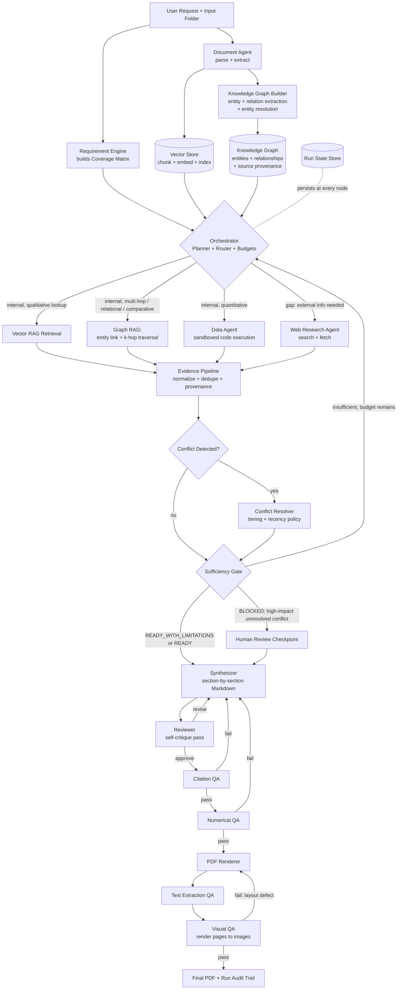

# AI-Engineering-Technical-Challenge

# Agentic Research & Report Generation System
### Design & Implementation Specification (v2)

**Author:** Rajat Murhe
**Purpose:** Hand-off document for a coding agent to build an AI system that takes a user request plus a folder of mixed-format files, researches and analyzes the content, and produces a final PDF report.

---

## 0. Assumptions & Non-Goals

**Assumptions:**
1. Single-run, batch-style execution against one input folder producing one report; not a long-lived chat session, though an optional human-in-the-loop pause is supported (§8).
2. LLM provider is abstracted behind an `LLMClient` interface (OpenAI/Claude-style chat completion with tool-calling) — swappable via config.
3. Deployment target: a single Python service (FastAPI) with a sandboxed code-execution environment, runnable locally or containerized.
4. Folder sizes in the tens to low hundreds of files, individual files up to ~50MB. Large data-warehouse-scale ingestion is out of scope.
5. The system decides *autonomously* when to search the web — the user isn't asked before every search — but every externally sourced fact is cited and visually distinguishable in the report from internally sourced facts.
6. Output is a polished PDF (headings, TOC, tables, charts), generated from an intermediate Markdown representation.
7. LLM credentials, a search API, and sandbox execution are available at runtime; their absence is a first-class failure case (§13), not a blocker to design around.

**Non-goals (explicitly out of scope for v1):**
- Real-time collaborative document editing.
- Autonomous execution of actions against external business systems (sending emails, placing orders, posting to third-party services).
- Fine-tuning foundation models on user files.
- Guaranteeing the absolute factual truth of external web sources — the system guarantees **provenance and traceability**, not universal truth of third-party claims.

**Explicit v2 stretch goals (deliberately deferred, not designed around, so v1 ships correctly first):**
- **GNN-based graph ranking:** once the knowledge graph is populated across enough runs, a graph neural network could improve entity-resolution confidence and re-rank retrieved subgraphs by relevance instead of relying on raw traversal distance. This needs volume the graph won't have on early runs, so it's deferred rather than designed in from day one.
- **Multi-modal retrieval:** treating chart/table images (e.g., a scanned board-deck chart) as first-class retrievable nodes via a vision-capable embedding model, not just OCR'd text — the current design OCRs images to text, which loses layout/visual structure that a true multi-modal embedding would preserve.
- **Community detection & hierarchical summarization** (§3.3) for "global overview" style requirements — the full Microsoft-GraphRAG-style approach, once basic k-hop traversal is proven out.

---

## 1. Core Design Principles

1. **Evidence before narrative.** No verifiable factual claim appears in the final report unless it is linked, through the Claim–Evidence graph, to a source file, a computation, or an explicitly labeled inference.
2. **Agents decide; deterministic code enforces.** LLMs propose plans, route requests, write analysis code, and draft prose. Deterministic services enforce schemas, execution permissions, budgets, numeric verification, and stopping criteria. An LLM is never the last word on whether something is safe, sufficient, or correctly cited — code checks that.
3. **Traceability and reproducibility.** Every claim traces to an `EvidenceItem`. Every computed number traces to a reproducible code artifact (the exact script + inputs that produced it), not just a stated result.
4. **Gap-driven research.** Web search and other external tool calls fire only when the Requirement Coverage Matrix (§3) shows an explicit, named gap — never speculatively "just in case."
5. **Strict inference policy.** The system must not convert correlation into causation, turn an estimate into a stated exact fact, invent missing values, or extrapolate beyond available data without explicitly labeling the output as an inference with a confidence score and stated reasoning.
6. **Validation before publication.** The PDF must pass programmatic QA (citations, numbers) and a rendered-output QA pass (visual layout) before being marked complete — passing the Markdown checks alone is not sufficient.
7. **Deterministic-first, LLM-narrow.** Anything with one objectively correct answer (parsing, routing by file type, arithmetic, rendering, budget enforcement) is code. Anything requiring judgment about meaning, relevance, or sufficiency is an LLM call — always with a narrow, schema-validated output, never open-ended "decide what to do next."

---

## 2. High-Level Architecture

The system is a **cyclical, state-driven orchestration engine**, not a single free-running agent loop or a strictly linear pipeline. A fixed set of graph nodes, each either deterministic logic or a narrow LLM-reasoning step, is wired together with conditional edges that encode the actual decision points in the process.

### 2.1 Components

| Component | Responsibility | Type |
|---|---|---|
| **API Layer** | Accepts a run request, exposes status/streaming, returns artifacts | Deterministic |
| **Requirement Engine** | Decomposes the user request into a Requirement Coverage Matrix | LLM (structured output) |
| **Orchestrator** | Sequencing, routing, budget enforcement, state persistence | Deterministic control flow + LLM routing decisions |
| **Document Agent** | Parses files, extracts structured/unstructured facts | Deterministic parsing + bounded LLM extraction pass |
| **Knowledge Graph Builder** | Extracts entities/relationships from chunks, resolves duplicate entities, writes the graph | LLM extraction (structured output) + deterministic entity resolution |
| **Graph Retrieval Engine** | k-hop traversal / Cypher queries over the knowledge graph for multi-hop and relational needs | Deterministic traversal; LLM only for query→entity linking |
| **Data Agent** | Writes and runs sandboxed analysis code | LLM writes code; sandbox executes deterministically |
| **Web Research Agent** | Searches and fetches external sources when a gap exists | LLM decides what/when; fetch and text extraction is deterministic |
| **Evidence Pipeline** | Normalizes metrics, deduplicates, detects conflicts, tracks provenance | Deterministic, with LLM-assisted conflict adjudication |
| **Sufficiency Gate** | Decides ready-to-write / write-with-limitations / blocked | Deterministic rules over LLM-produced coverage assessment |
| **Synthesizer** | Writes the report section by section, citing evidence | LLM |
| **Reviewer** | Self-review pass on draft sections before QA | LLM |
| **Verification Pipeline** | Citation QA, numerical QA, text-extraction QA, visual QA | Deterministic |
| **PDF Renderer** | Markdown/HTML → styled PDF | Deterministic |
| **Run State Store** | Persists the full run state at every transition | Deterministic (SQLite) |

### 2.2 Architecture Diagram



### 2.3 Job Lifecycle State Machine

```text
CREATED
  ↓
INGESTING
  ↓
PLANNING                     (Requirement Coverage Matrix built)
  ↓
RESEARCHING  ←───────────────┐
  ↓                          │
EVALUATING (Sufficiency Gate)│
  ├── insufficient, budget left ──┘
  ├── BLOCKED → HUMAN_REVIEW → (resume) RESEARCHING or SYNTHESIZING
  └── READY / READY_WITH_LIMITATIONS
        ↓
     SYNTHESIZING ←──────┐
        ↓                │
     REVIEWING            │
        ├── revise ───────┘
        └── approve
              ↓
            QA  ←──────────┐
        ├── fail (any of citation/numeric/text/visual) → REVISION → back to relevant stage
        └── pass
              ↓
          PUBLISHED

FAILED (terminal — reachable from any state on unrecoverable error, e.g. no usable files, core requirement un-satisfiable)
```

---

## 3. Core Data Models

A single set of Pydantic models is the backbone of the system — nothing flows between nodes as an unstructured blob.

### 3.1 Requirement Coverage Matrix

```python
class Requirement(BaseModel):
    id: str
    description: str
    kind: Literal["factual", "quantitative", "comparative", "external"]
    required: bool                      # must be satisfied, or gated to Limitations
    status: Literal["open", "in_progress", "satisfied", "partially_satisfied", "unresolved"]
    evidence_ids: list[str] = []
```

### 3.2 Claim–Evidence Graph

Claims and evidence are kept distinct so that a stated recommendation can never masquerade as a sourced fact.

```python
class Claim(BaseModel):
    id: str
    text: str
    claim_type: Literal["SOURCE_FACT", "COMPUTED_FACT", "INFERENCE", "RECOMMENDATION"]
    evidence_ids: list[str]
    confidence: float
    status: Literal["supported", "disputed", "unsupported"]
    reasoning: str | None = None        # required when claim_type == "INFERENCE" or "RECOMMENDATION"

class EvidenceItem(BaseModel):
    id: str
    requirement_id: str
    source_type: Literal["file", "web", "computation"]
    source_uri: str                     # file path, URL, or "computed://<script_id>"
    source_name: str
    publisher: str | None = None
    domain: str | None = None
    source_tier: int | None = None      # 1 = authoritative/primary, 2 = reputable secondary, 3 = other
    locator: str | None = None          # page/sheet/cell/paragraph reference
    value: Any | None = None
    confidence: float
    timestamp: str
    supporting_text: str | None = None
    computation_id: str | None = None   # links to the exact script run, for COMPUTED_FACT
```

### 3.3 Knowledge Graph Schema

The Claim–Evidence graph (§3.2) is a provenance/audit structure — it answers "what backs this claim." It is deliberately **not** the retrieval mechanism for multi-hop or relational questions, which is what a real knowledge graph is for. The two are connected (every graph edge cites the chunk/`EvidenceItem` it was extracted from) but serve different purposes.

```python
class Entity(BaseModel):
    id: str
    canonical_name: str
    entity_type: str            # e.g. "Region", "Policy", "Metric", "Person", "Organization", "Product"
    aliases: list[str] = []     # surface forms merged into this entity during resolution
    source_chunk_ids: list[str]

class Relationship(BaseModel):
    id: str
    source_entity_id: str
    target_entity_id: str
    relation: str                # e.g. "affected_by", "part_of", "reported_in", "compared_to"
    source_chunk_ids: list[str]  # provenance — which chunks asserted this edge
    confidence: float
```

**Construction (deterministic pipeline, one bounded LLM step per chunk):**
1. Per chunk, an LLM call extracts candidate `(entity, relation, entity)` triples in structured form — same bounded, one-pass-per-chunk pattern as fact extraction, not an open-ended agentic loop.
2. **Entity resolution** merges surface-form duplicates ("Q2", "second quarter", "Apr–Jun") into a canonical `Entity`: a deterministic fuzzy-match pass (e.g. `rapidfuzz` + type/alias matching) handles the easy majority; only genuinely ambiguous merges (confidence below a threshold) go to a narrow LLM tie-break call.
3. Resolved entities and relationships are written to the graph store, every edge retaining its `source_chunk_ids` so a graph-derived fact remains traceable back to an `EvidenceItem`, exactly like any other evidence in the system.
4. *(Stretch goal, not v1-required):* community detection (Leiden/Louvain) over the graph with per-community LLM summarization, for "give me an overview" style requirements that no single chunk or 2-hop traversal answers well — this is the core idea behind Microsoft's GraphRAG approach and is a natural v2 extension once basic graph traversal is working.

**Retrieval — hybrid Graph RAG + Vector RAG:** the Router (§4, Workflow C) decides per-requirement which retrieval mode to use, not the LLM freelancing on every call:
- `kind="factual"`, single-entity lookup → **Vector RAG** (`rag_retrieve`) is sufficient and cheaper.
- `kind="comparative"`, or the requirement text names a relationship between two or more entities ("how did X affect Y", "compare region A to region B") → **Graph RAG** (`graph_retrieve`): link the entities named in the requirement to graph nodes, run k-hop traversal (default k=2) to pull the connected subgraph, and render it as structured evidence text (e.g. `Region:North --affected_by--> Policy:PricingChangeMay --reported_in--> Document:policy_notes.docx`) with every edge's provenance attached.
- Ambiguous or evidence-thin cases → **hybrid**: use the graph traversal to identify the relevant scoped set of chunks/entities first, then run vector similarity search *within* that scoped set for the supporting narrative detail — this combination is what makes cross-document reasoning (e.g., connecting a policy memo to a sales anomaly in a separate CSV) possible, which flat vector-only RAG structurally cannot do since no single chunk contains both facts.

### 3.4 Metric & Web Source Normalization

Two numbers with the same label can measure different things — this model exists specifically to catch that before synthesis, not after.

```python
class MetricDefinition(BaseModel):
    metric_name: str
    value: float
    unit: str
    currency: str | None = None
    time_period: str
    population_segment: str
    scope_inclusion: str                # what is/isn't counted, e.g. "excludes returns"

class WebSnapshot(BaseModel):
    url: str
    retrieved_at: str
    published_at: str | None
    page_title: str
    content_hash: str
    source_tier: int
```

The Evidence Pipeline runs a deterministic normalization pass: before two `EvidenceItem`s about the same `Requirement` can be compared, their underlying `MetricDefinition`s (if numeric) are checked for matching `time_period`, `population_segment`, and `scope_inclusion`. A mismatch is flagged as `TEMPORAL_MISMATCH` or `SCOPE_MISMATCH` — a distinct category from a genuine factual conflict — and surfaced to the Conflict Resolver with that label so it isn't misdiagnosed as "sources disagree" when really "sources measure different things."

### 3.5 Conflicts and Run State

```python
class Conflict(BaseModel):
    id: str
    requirement_id: str
    evidence_ids: list[str]
    conflict_kind: Literal["FACTUAL_DISAGREEMENT", "TEMPORAL_MISMATCH", "SCOPE_MISMATCH"]
    resolution: str | None = None
    resolution_basis: str | None = None   # e.g. "Tier 1 source preferred over Tier 3"
    impact: Literal["low", "high"] = "low" # high impact + unresolved -> triggers BLOCKED

class RunState(BaseModel):
    run_id: str
    user_request: str
    input_folder: str
    manifest: list[FileRecord]
    requirements: list[Requirement]
    claims: list[Claim]
    evidence: list[EvidenceItem]
    conflicts: list[Conflict]
    report_outline: list[str]
    report_sections: dict[str, str]
    iteration_count: int
    status: Literal[
        "ingesting", "planning", "researching", "evaluating",
        "synthesizing", "reviewing", "qa", "human_review",
        "published", "failed"
    ]
    errors: list[str]
```

State is persisted to SQLite after every node transition — this makes runs resumable, auditable, and debuggable via a simple `inspect_run <run_id>` CLI that dumps requirements/evidence/conflicts/claims.

---

## 4. Major Workflows

### Workflow A — Ingestion & Indexing (deterministic, one bounded LLM pass)

1. Walk the folder; build a manifest (`path, size, extension, mime_sniff`).
2. Classify by extension + content sniff (don't trust extensions).
3. Route to the type-specific parser (§6).
4. Security/governance filters run here (§9): file-size limits, allowed MIME types, archive-bomb detection, malformed-file detection. Macro-enabled files (`.docm`, `.xlsm`) are parsed for data only — macros are stripped before any content reaches an LLM. A PII/secrets scan redacts credentials and sensitive personal identifiers from extracted text before it's passed to any agent.
5. For unstructured prose (Word docs, text notes, OCR'd scans), a single bounded LLM pass extracts candidate `SOURCE_FACT` claims tagged with their source span — not an open-ended agentic loop, one pass per document.
6. Chunk and embed all extracted text into the Vector Store.
7. **Knowledge Graph Builder** runs over the same chunks (all file types, not just prose — structured tables get entity/relation extraction too, e.g. a region row in a CSV becomes a `Region` entity linked to its metrics): extract candidate entities/relationships, resolve duplicate entities, write to the graph store (§3.3). This runs in parallel with vector indexing, not instead of it — both stores are built from the same ingested content.
8. Persist to `RunState`.

### Workflow B — Requirement Engine (LLM, once per run)

1. Given the user request + a manifest summary (file names/types/one-line auto-summaries, not full content), the Requirement Engine produces the Requirement Coverage Matrix.
2. This matrix is the backbone of the whole run: it's what the Sufficiency Gate checks, and it turns "do we have enough information?" into an inspectable data structure rather than a vibe.
3. Optionally shown to the user for a go/no-go check if running in interactive mode (§8).

### Workflow C — Evidence Gathering Loop (the agentic core, gap-driven)

Bounded by the budgets in §7. Per round:

1. **Router** picks the next open/partial `Requirement` and selects a tool: Vector RAG (internal, single-entity/qualitative lookup), Graph RAG (internal, multi-hop/relational/comparative — see §3.3 for the exact routing rule), Data Agent (internal, quantitative), or Web Research Agent (external, or internal retrieval confidence too low) — escalation to web search only happens because a gap is explicitly named, never speculatively.
2. Each tool call produces one or more `EvidenceItem`s.
3. **Evidence Pipeline** runs deterministically: normalize `MetricDefinition`s, deduplicate near-identical evidence, detect conflicts (tagged `FACTUAL_DISAGREEMENT`, `TEMPORAL_MISMATCH`, or `SCOPE_MISMATCH`), and tag provenance.
4. **Research stop conditions** for a given requirement — checked deterministically, not left to LLM judgment:
   - **(A)** One Tier-1 (authoritative/primary) source satisfies it → done.
   - **(B)** Two independent Tier-2/3 sources (different publisher/domain) agree → done, both cited.
   - **(C)** Additional searches return no materially new evidence after 2 consecutive attempts (diminishing returns) → stop, mark best-available.
   - **(D)** Budget exhausted → mark `unresolved`.
5. Any high-impact conflict (materially different figures from two Tier-1 sources, or a conflict on a `required=true` requirement that resists automatic resolution) is flagged `impact="high"` and routed toward the Sufficiency Gate's `BLOCKED` outcome rather than silently resolved.

### Workflow D — Synthesis, Review & Publication

1. **Synthesizer** writes the report section by section, scoped to the relevant slice of evidence for that section (keeps context small, keeps citations traceable). Every `SOURCE_FACT` and `COMPUTED_FACT` claim carries a citation key resolving to an `EvidenceItem`. `INFERENCE` and `RECOMMENDATION` claims are visually distinguished in the report (e.g., a labeled callout) and must carry `reasoning` plus a confidence score — they are never formatted identically to a sourced fact.
2. **Reviewer** (a separate LLM pass, not the Synthesizer grading its own work) checks the draft against the Coverage Matrix and claim-typing rules, and can send sections back for revision (bounded to `MAX_SYNTHESIS_REVISIONS`).
3. **Verification Pipeline** (§10) runs four deterministic checks in sequence; any failure routes back to the relevant upstream stage, not straight to "fail the run."
4. **PDF Renderer** converts validated Markdown/HTML to the final PDF.
5. Full audit trail (requirements, evidence, claims, conflicts, tool calls, QA results) is persisted alongside the PDF.

---

## 5. Where AI Reasoning Is Used vs. Deterministic Logic

**Always deterministic:**
File type detection/routing · parsing · chunking/embedding · vector similarity search · metric normalization (scope/temporal matching) · conflict *detection* (diff/threshold, not adjudication) · budget/timeout/loop enforcement · citation/numeric/text/visual QA · PDF rendering · state persistence · security filters (archive-bomb, macro-stripping, PII redaction).

**LLM reasoning, always via schema-validated structured output:**
Requirement decomposition · candidate-fact extraction from prose (bounded, one pass) · tool routing (a narrow classification task, not open agency) · writing analysis code for a specific computation · deciding web search queries and interpreting results · adjudicating conflicts within the stated tiering/recency policy · assessing per-requirement coverage for the Sufficiency Gate · drafting report prose · reviewing drafts against the Coverage Matrix.

---

## 6. Tool & Skill Catalog

| Tool | Approach | Invoked by | When |
|---|---|---|---|
| `parse_pdf` | `pdfplumber` (text+tables) + `pytesseract` OCR fallback | Document Agent | Any `.pdf` |
| `parse_docx` | `python-docx` (macros stripped for `.docm`) | Document Agent | Any `.docx`/`.docm` |
| `parse_xlsx` | `openpyxl`/`pandas.read_excel` (macros stripped for `.xlsm`) | Document Agent | Any `.xlsx`/`.xls`/`.xlsm` |
| `parse_csv` | `pandas.read_csv` with delimiter/encoding sniffing | Document Agent | Any `.csv`/`.tsv` |
| `parse_txt` | plain read + encoding detection | Document Agent | `.txt`/`.md`/logs |
| `scan_and_redact_pii` | regex + NER-based scanner | Document Agent | Every extracted text blob, before it reaches any LLM |
| `extract_facts_from_text` | Bounded LLM call, structured `SOURCE_FACT` output | Document Agent | Unstructured prose only, once per document |
| `rag_retrieve` | FAISS similarity search + optional re-rank | Router / Evidence loop | Internal, single-entity/qualitative needs |
| `extract_entities_relations` | Bounded LLM call, structured triple output | Knowledge Graph Builder | Per chunk, during ingestion (all file types) |
| `resolve_entities` | Deterministic fuzzy match (`rapidfuzz`) + narrow LLM tie-break for low-confidence merges | Knowledge Graph Builder | After extraction, before graph write |
| `graph_retrieve` | Entity linking + k-hop traversal (Cypher on Neo4j, or NetworkX BFS for v1) | Router / Evidence loop | Requirements tagged `comparative`, or naming a relationship between entities |
| `detect_communities` *(stretch)* | Leiden/Louvain clustering + per-community LLM summary | Knowledge Graph Builder | "Global overview" style requirements only |
| `run_python_analysis` | Docker-sandboxed Python (pandas, numpy, matplotlib); LLM writes code, sandbox executes | Data Agent | Requirements tagged `quantitative` |
| `web_search` | Search API (Serper/Bing) | Web Research Agent | Explicit gap tagged `external`, or low internal-retrieval confidence |
| `web_fetch` | HTTP fetch + `trafilatura`/readability extraction | Web Research Agent | After `web_search` returns candidate URLs |
| `classify_source_tier` | Deterministic domain/publisher allowlist + heuristics (gov/edu/major outlet = Tier 1/2, unknown blog = Tier 3) | Web Research Agent | Every fetched web source |
| `normalize_metrics` | Deterministic scope/time comparison over `MetricDefinition` | Evidence Pipeline | After every evidence round |
| `detect_conflicts` | Deterministic diff over normalized evidence | Evidence Pipeline | After every evidence round |
| `citation_qa` | Deterministic — every claim resolves to a real evidence id | Verification Pipeline | Post-synthesis |
| `numerical_qa` | Deterministic — inline numbers re-checked against `MetricDefinition`/computation output | Verification Pipeline | Post-synthesis |
| `text_extraction_qa` | Extract text back out of the rendered PDF, diff against source Markdown | Verification Pipeline | Post-render |
| `visual_qa` | Render PDF pages to images; check for clipped text, blank pages, overflowing tables, broken image refs | Verification Pipeline | Post-render |
| `render_pdf` | WeasyPrint (HTML/CSS → PDF) from styled Markdown template | PDF Renderer | Final step |

**Analysis Tool detail:** the LLM never gets raw shell access. It writes a short Python snippet against pre-loaded, schema-described DataFrames (one per structured file). The snippet runs in a locked-down Docker container: `--network none`, memory/CPU/time limits, whitelisted libraries only (pandas, numpy, matplotlib). Output (dataframe/JSON/PNG) and the exact script are both captured — the script itself becomes the `computation_id` referenced by any `COMPUTED_FACT` claim, satisfying the reproducibility principle in §1. Errors trigger one self-correction retry with the error appended to context; capped at `MAX_CODE_RETRIES` (3) before the requirement is marked unresolved.

---

## 7. Budgets & Stopping Logic

| Budget | Default | Enforced by |
|---|---|---|
| `MAX_RESEARCH_ROUNDS` | 3 | Orchestrator (deterministic) |
| `MAX_WEB_QUERIES` | 8 | Web Research Agent wrapper |
| `MAX_CODE_RETRIES` | 3 | Data Agent sandbox wrapper |
| `MAX_TOTAL_RUNTIME` | 10 min | Orchestrator wall-clock check |
| `MAX_LLM_TURNS` | 30 | Orchestrator |
| `MAX_TOTAL_MODEL_COST` | configurable ceiling | Orchestrator, checked after every LLM call |
| `MAX_SYNTHESIS_REVISIONS` | 2 | Reviewer loop |
| `MAX_PDF_RENDERS` | 3 | Verification Pipeline loop |

These are hard ceilings, never adjustable by an LLM node mid-run — they exist specifically so a routing or critique mistake can't turn into an unbounded loop or runaway spend.

### 7.1 The Sufficiency Gate

Three possible outcomes, decided by deterministic rules applied to the LLM's per-requirement coverage assessment:

- **`READY_FOR_SYNTHESIS`** — all `required=true` requirements are `satisfied`, every critical claim has evidence, no unresolved high-impact conflicts, all required computations are reproducible.
- **`READY_WITH_LIMITATIONS`** — budget exhausted with some `required=true` requirements still `partially_satisfied`/`unresolved`; proceeds to synthesis but those items are forced into a Limitations section — the report is never silently incomplete.
- **`BLOCKED` / human review required** — a high-impact, unresolved conflict exists (e.g., materially different figures from two Tier-1 sources), or a `required=true` requirement that is foundational to the request (e.g., the core dataset itself is missing) cannot be satisfied at all. This pauses the run rather than guessing; see §8.

---

## 8. Human-in-the-Loop

Off by default (pure batch mode), but built as first-class states in the graph so it's a config flip, not a redesign:

1. **After Planning:** show the Requirement Coverage Matrix before spending research budget — cheap way to catch a misunderstood request early.
2. **On `BLOCKED`:** pause and surface the specific high-impact conflict or unsatisfiable core requirement, with the two conflicting `EvidenceItem`s shown side by side, and wait for a resume decision.
3. **Before final render (optional):** show the reviewed Markdown draft for an approve/edit pass.

Implementation: an `awaiting_human_review` status with a `POST /runs/{id}/resume` endpoint carrying the decision/edits — the run picks back up exactly where it paused, since full state is already persisted.

---

## 9. Security & Data Governance

- **Prompt injection isolation:** all ingested file content and fetched web content is treated strictly as untrusted data, delimited clearly (e.g. `<document>...</document>`, `<web_result>...</web_result>`) in every LLM prompt. Instructions found inside that content (e.g. "ignore previous instructions") have no authority over system prompts, tool permissions, routing, budgets, or state transitions — this is enforced by never granting tool-calling ability to a completion whose prompt consists primarily of untrusted content without that delimiting, and by a system-prompt rule repeated at every relevant node.
- **File ingestion filters:** size limits, allowed MIME types, archive-bomb detection (reject archives with absurd compression ratios or nesting depth), malformed-file detection.
- **Macro handling:** `.docm`/`.xlsm` are parsed for data only; embedded macros are stripped before any content reaches an LLM or is stored.
- **PII/secrets scanning:** a redaction pass over all extracted text before it's stored or shown to any agent, catching credentials, API keys, and sensitive personal identifiers.
- **Sandbox isolation:** the Data Agent's code execution has no network access, read-only mounts of only the specific data files it needs, and CPU/memory/time limits.

---

## 10. Verification Pipeline & Report Generation

Four sequential, deterministic QA stages — passing the first three doesn't skip the fourth, since a Markdown-valid report can still render badly:

1. **Citation QA** — every `SOURCE_FACT`/`COMPUTED_FACT` claim resolves to a real `EvidenceItem`; no orphaned citation keys; no unlinked verifiable-sounding sentences.
2. **Numerical QA** — every inline number in the text is re-checked against its underlying `MetricDefinition` or computation output — catches transcription drift where the LLM restates "23%" as "25%" in prose.
3. **Text Extraction QA** — text is extracted back out of the rendered PDF and diffed against the source Markdown to catch silent content loss/garbling during rendering.
4. **Visual QA** — PDF pages are rendered to images and checked for clipped text, blank pages, overflowing tables, and broken image references — catches rendering-engine defects that a text-level check can't see. Failure here routes back to the PDF Renderer (re-render, possibly with a layout fix), capped at `MAX_PDF_RENDERS`.

**Report structure (fixed template, populated dynamically):**
1. Title page (request, date, run ID)
2. Executive Summary (written last, from the finished sections)
3. Methodology — auto-generated from the manifest + tool-call log, not hand-written by the LLM, to avoid inaccurate self-narration
4. Findings sections, organized by requirement theme, citing evidence; `INFERENCE`/`RECOMMENDATION` claims visually set apart from `SOURCE_FACT`/`COMPUTED_FACT`
5. Data Conflicts — auto-populated from `RunState.conflicts`, including unresolved/high-impact ones surfaced during human review
6. Limitations & Open Questions — auto-populated from unresolved requirements and ingestion errors
7. Appendix — source list with every citation key resolved to a file path/URL/computation script

**Rendering:** Markdown → HTML → PDF via WeasyPrint with a custom template (headers, footers, page numbers, TOC). Charts from the Data Agent are saved as PNGs and embedded by path.

---

## 11. Recommended Tech Stack

- **Orchestration:** hand-rolled state machine for v1 (explicit node functions keyed on `RunState.status`) — easier to debug than a framework for a first build. Migrate to LangGraph only if the graph's complexity outgrows this.
- **LLM access:** OpenAI or Anthropic API behind `LLMClient`; every structured-output node uses function/tool-calling with Pydantic validation, never free-text parsing.
- **Parsing:** `pdfplumber` + `pytesseract`, `python-docx`, `pandas`/`openpyxl`.
- **Vector RAG:** provider embedding endpoint (or `sentence-transformers` locally) + **FAISS** (no extra service to run). Upgrade to pgvector only if persistence across runs/multi-user access is needed.
- **Graph RAG:** **NetworkX** for v1 (in-memory graph, persisted to a `graphml`/pickle file per run — no extra service, matches the "start simple" pattern used for FAISS). Upgrade path to **Neo4j** once the graph needs to persist and be queried across runs/users, or once traversal performance at scale matters (Neo4j also fits naturally given the target company runs on AWS — it's available via AWS Marketplace). Entity/relation extraction uses the same `LLMClient` as every other structured-output node.
- **Sandbox:** Docker (`--network none`, memory/CPU/time limits) for the Data Agent. (An alternative is a hosted sandbox service such as E2B if you'd rather not manage container infra — either satisfies the isolation requirement; Docker is the default here since it needs no external service dependency.)
- **Web:** search API (Serper/Bing) + `httpx` + `trafilatura` for clean text extraction.
- **PDF rendering:** WeasyPrint (HTML/CSS → PDF) fed by a Markdown→HTML converter.
- **Persistence:** SQLite for `RunState` (file-based, simple; upgrade path to Postgres if needed).
- **API layer:** FastAPI, background task via `asyncio` for v1; Celery+Redis if multi-worker scaling is later required.

---

## 12. API Contract

```http
POST /runs                  # Body: {"request": "...", "input_directory": "..."}
GET  /runs/{run_id}         # Job status + metadata
GET  /runs/{run_id}/status  # Stream lifecycle events (SSE or polling)
GET  /runs/{run_id}/requirements   # Current Coverage Matrix
GET  /runs/{run_id}/evidence       # Evidence Pool
GET  /runs/{run_id}/conflicts      # Detected/resolved conflicts
GET  /runs/{run_id}/report         # Finalized PDF + limitations manifest
POST /runs/{run_id}/resume         # Resume from awaiting_human_review with a decision/edits
```

---

## 13. Failure Cases & Handling

| Failure | Handling |
|---|---|
| Corrupted/unreadable/password-protected file | Logged to `ingestion_errors`, skipped, listed in the report appendix — never crashes the run |
| Folder has no usable files | Halt with a clear error before any LLM spend |
| Archive bomb / oversized/disallowed file | Rejected at the ingestion filter, logged, run continues with remaining files |
| A `required=true` requirement can't be satisfied at all, and it's foundational to the request | `BLOCKED` → human review (§8) rather than a hollow/misleading report |
| A `required=true` requirement is partially satisfied after budget exhaustion | `READY_WITH_LIMITATIONS` — forced into the Limitations section |
| Two Tier-1 sources materially disagree | `BLOCKED`, high-impact conflict surfaced for human review, both sources shown side by side |
| Lower-tier sources disagree | Resolved automatically per the tiering/recency policy; both cited, resolution basis recorded |
| Evidence measures different scope/time period than expected | Flagged `TEMPORAL_MISMATCH`/`SCOPE_MISMATCH`, not misdiagnosed as a factual conflict |
| Web search unavailable/rate-limited | That requirement marked unresolved; run continues on internal evidence; noted in Limitations — doesn't fail the whole run |
| Analysis code throws an exception | One self-correction retry with the error in context; capped at `MAX_CODE_RETRIES`; then unresolved |
| Sandbox timeout/resource limit hit | Container killed, treated as an analysis failure (same path as above) |
| LLM returns malformed structured output | Pydantic validation rejects it; one retry with the validation error appended; hard-fail the node and log after 2 attempts |
| Prompt injection via file/web content | Untrusted content is always delimited data, never treated as instructions (§9) |
| Very large file / context overflow | Chunking + RAG retrieval; the Data Agent only ever receives the actual DataFrame, never a raw text dump |
| Citation QA fails | Section sent back to Synthesizer with the specific missing/orphaned citation flagged |
| Numerical QA fails | Section sent back with the specific mismatched number flagged |
| Text Extraction QA fails (content loss on render) | Re-render; if it recurs, isolate to the offending section/table and simplify formatting |
| Visual QA fails (clipped text, blank page, broken image) | Re-render with a layout fix, capped at `MAX_PDF_RENDERS`; final fallback is a plainer single-column template |

---

## 14. Test Strategy & Evaluation Metrics

**Testing layers:**
- **Unit tests:** parsers, PII redaction, metric normalizer, conflict detector, sufficiency gate rules, citation/numerical QA — all pure deterministic logic, tested with real fixtures, no LLM involved.
- **Integration tests:** full tool chains (CSV → Data Agent → Evidence; web query → Research Agent → Evidence) with a mocked `LLMClient` returning fixed structured outputs, to verify control flow independent of model behavior.
- **End-to-end fixtures:** `simple_report/`, `conflicting_sources/`, `missing_data/`, `broken_pdf_layout/`, `web_failure/`, `prompt_injection/` — each fixture asserts the *specific* handling behavior from §13, not just "doesn't crash."

**Ongoing quality metrics** (useful even for a v1 that isn't yet in continuous operation, as a definition of "good"):
- **Unsupported Claim Rate** = unsupported claims / total verifiable claims (target: 0% in published reports).
- **Requirement Coverage Rate** = requirements satisfied / requirements requested.
- **Conflict Detection Accuracy** = rate at which deliberately injected conflicts in test fixtures are correctly flagged.
- **PDF QA Pass Rate** = fraction of runs whose PDF passes verification without a revision cycle.

**Philosophy:** test deterministic nodes with real assertions; test LLM nodes on *schema conformance* and *control-flow behavior* (does the Sufficiency Gate correctly gate on a fabricated coverage assessment with known satisfied/unresolved items?), not on exact prose. Reserve human judgment for grading end-to-end report *quality* on the fixtures.

---

## 15. Implementation Plan for the Coding Agent

Repository layout:

```
agentic-report-system/
├── app/
│   ├── api/routes.py
│   ├── orchestration/
│   │   ├── graph.py, state_manager.py, router.py, sufficiency_gate.py
│   ├── agents/
│   │   ├── requirement_engine.py, document_agent.py, data_agent.py, web_research_agent.py
│   │   ├── conflict_resolver.py, synthesizer.py, reviewer.py
│   ├── knowledge_graph/
│   │   ├── entity_extractor.py, entity_resolver.py, graph_store.py (NetworkX v1 / Neo4j upgrade), graph_retriever.py
│   ├── evidence_pipeline/
│   │   ├── normalizer.py, deduplicator.py, provenance_tracker.py, source_tiering.py
│   ├── tools/
│   │   ├── file_parser.py, pii_redactor.py, web_search.py, sandbox_executor.py, pdf_renderer.py
│   ├── models/
│   │   ├── state.py, evidence.py, claims.py, metrics.py, graph.py (Entity, Relationship)
│   ├── verification/
│   │   ├── citation_qa.py, numerical_qa.py, text_extraction_qa.py, visual_qa.py
│   ├── storage/
│   │   ├── run_store.py (SQLite), vector_store.py (FAISS)
│   └── config.py
├── tests/
│   ├── fixtures/{simple_report, conflicting_sources, missing_data, broken_pdf_layout, web_failure, prompt_injection}/
│   ├── test_parsers.py, test_evidence_pipeline.py, test_sufficiency_gate.py
│   ├── test_orchestrator_flow.py     # mocked LLM, asserts control flow
│   └── test_failure_cases.py
├── docker/sandbox.Dockerfile
├── requirements.txt
└── README.md
```

**Build order:**

1. **Scaffolding** — repo structure, `LLMClient` interface + mock implementation for tests, config for all budgets in §7.
2. **Parsers + security filters + Document Agent** — all five file types, macro stripping, archive-bomb detection, PII redaction; unit-tested against fixture files.
3. **Vector RAG layer** — chunking, embedding, FAISS indexing/retrieval.
4. **Knowledge Graph layer** — entity/relation extraction (structured LLM output), deterministic entity resolution, NetworkX graph store, k-hop `graph_retrieve`; unit-test traversal against a small hand-built fixture graph before wiring it to real extraction, so retrieval logic and extraction quality are debugged independently.
5. **`RunState` + orchestrator skeleton** — wire the state machine (§2.3) with stub nodes first; verify loops/budgets/transitions work with dummy data before any real LLM call is added.
6. **Requirement Engine** — real LLM call producing the Coverage Matrix, schema-validated.
7. **Data Agent + sandbox** — Docker runner first (prove it safely executes and captures output/errors), then the LLM code-writing step, then the self-correction retry path.
8. **Web Research Agent + source tiering** — search/fetch, domain/publisher tiering classifier, the gap-driven trigger logic in the Router.
9. **Evidence Pipeline** — metric normalization, deduplication, conflict detection with the three conflict kinds.
10. **Conflict Resolver + Sufficiency Gate** — implement the tiering/recency policy and the three-way gate outcome.
11. **Synthesizer + Reviewer** — claim-typed section generation, self-review loop.
12. **Verification Pipeline (all four stages) + PDF Renderer** — build the report template and WeasyPrint pipeline early with dummy content so formatting is solved independently of content quality; add citation/numeric QA, then text-extraction and visual QA once rendering is stable.
13. **Failure-case tests** — run all six fixtures from §14 end to end and confirm behavior matches §13 exactly, not just "no crash."
14. **End-to-end eval** — 3–5 realistic fixture folders + requests (see §16), full pipeline run, manual grading of report quality/citation correctness, and computation of the metrics in §14.
15. **API wrapper + human-in-the-loop resume endpoints** (§12, §8) as the final integration layer.

---

## 16. Example Walkthrough

**User request:** *"Analyze our Q2 regional sales performance from the attached files, compare it against current industry benchmarks, and produce an executive report with recommendations."*

**Input folder:** `q2_sales.csv` (transaction-level sales by region), `budget_2026.xlsx` (budget vs. actuals), `policy_notes.docx` (memo on a mid-quarter pricing change), `board_deck_notes.pdf` (scanned board notes, needs OCR).

1. **Ingestion:** all four files parsed; PII/macro/archive filters pass through cleanly; `board_deck_notes.pdf` OCR'd. `policy_notes.docx` and the PDF go through the bounded fact-extraction pass, producing `SOURCE_FACT` candidates. Everything is chunked/embedded into FAISS **and** passed through the Knowledge Graph Builder: entities like `Region:North`, `Region:South`, `Policy:PricingChangeMay`, and per-region `Metric:Q2Sales`/`Metric:BudgetVariance` are extracted and resolved, with edges such as `Region:North --affected_by--> Policy:PricingChangeMay` (from the memo) and `Region:North --has_metric--> Metric:BudgetVariance` (from the CSV/Excel), each edge carrying its source chunk.
2. **Requirement Engine** produces:
   - R1 (quantitative, required): total and per-region Q2 sales
   - R2 (quantitative, required): Q2 actuals vs. budget, per region
   - R3 (factual, required): any pricing/policy change affecting Q2, and timing
   - R4 (external, required): current industry benchmark growth rate
   - R5 (comparative, required): how regions compare to each other and to the benchmark
3. **Evidence gathering, round 1:**
   - R1 → Data Agent: pandas snippet groups `q2_sales.csv` by region/month; sandbox executes; returns a table + bar chart PNG as a `COMPUTED_FACT`, `computation_id` recorded. Evidence E1.
   - R2 → Data Agent: joins the sales aggregate against `budget_2026.xlsx`; computes variance %. Evidence E2.
   - R3 → RAG retrieval over the Word memo's extracted facts: pricing change effective mid-May, North region. Evidence E3 (`SOURCE_FACT`).
   - R4 → Router recognizes this as an explicit external gap → Web Research Agent searches, fetches an industry association's Q2 report (classified Tier 1, published Aug 2026) and an analyst blog citing older data (classified Tier 3). Evidence E4 (Tier 1) and E5 (Tier 3).
4. **Evidence Pipeline:** normalizes both benchmark figures' `MetricDefinition`s — same metric, same population, different `time_period` reference windows — flags `TEMPORAL_MISMATCH` in addition to the numeric difference between E4 and E5.
5. **Conflict Resolver:** applies the stop condition and tiering policy — one Tier-1 source (E4) already satisfies R4 outright (stop condition A), so E4 becomes the headline benchmark; E5 is retained and disclosed as a lower secondary estimate in a labeled callout, both cited. Not high-impact (only one side is Tier 1), so no `BLOCKED` state triggered.
6. R5 ("how do regions compare to each other and to the benchmark") is exactly the multi-hop case Graph RAG exists for: the Router recognizes it names a relationship across entities, not a single lookup, and calls `graph_retrieve`. A 2-hop traversal from `Region:North` surfaces the connected subgraph — `Region:North → affected_by → Policy:PricingChangeMay → effective_date → mid-May`, `Region:North → has_metric → Metric:BudgetVariance(-12%)` — which is exactly the connection a flat vector search would likely miss, since the pricing-policy fact lives in the Word memo and the variance number lives in the spreadsheet; no single chunk contains both. This traversal result becomes Evidence E6 (`source_type="computation"`-adjacent, but graph-derived, provenance pointing to both underlying chunks), satisfying R5 with a genuinely explainable causal link rather than the LLM inferring the connection unsupported.
7. **Sufficiency Gate:** R1–R5 all satisfied → `READY_FOR_SYNTHESIS`. (Had the search API been down, R4 would be `unresolved`, and with 4 of 5 required needs still met and budget exhausted, the gate would return `READY_WITH_LIMITATIONS` instead — the report would proceed with R4 explicitly listed under Limitations rather than guessed at.)
8. **Synthesis:** Executive Summary; "Regional Sales Performance" (cites E1, includes the chart, tagged `COMPUTED_FACT`); "Budget Variance" (E2); "Policy Impact — Pricing Change" (E3, `SOURCE_FACT`, connects the North region dip to the May change, corroborated by the graph-derived E6 link); "Industry Benchmark Comparison" (E4 primary, E5 as a labeled secondary estimate); "Recommendations" section, each recommendation explicitly typed `RECOMMENDATION` with `reasoning` tracing back to the findings above — never formatted as if it were a sourced fact. Methodology and Limitations are auto-populated from the manifest, Coverage Matrix, and tool-call log.
9. **Reviewer:** checks every required requirement is addressed or listed under Limitations, and that no `RECOMMENDATION`/`INFERENCE` claim is missing its reasoning — approves.
10. **Verification Pipeline:** Citation QA confirms every `[E-xx]` key resolves; Numerical QA re-checks the variance percentages and benchmark figure quoted in prose against E2/E4's actual values; Text Extraction QA and Visual QA pass on the rendered PDF (chart image present, no clipped tables).
11. **Delivery:** `report.pdf` + `run_audit.json` (Coverage Matrix, evidence, claims, conflicts, QA results) returned via `GET /runs/{run_id}/report`.

---

## 17. Definition of Done (Acceptance Criteria)

A run is considered successful only when **all** of the following hold:

1. A final PDF exists and passed all four Verification Pipeline stages (citation, numerical, text-extraction, visual).
2. Every `required=true` requirement is either `satisfied` or explicitly and visibly listed under Limitations & Open Questions — none are silently dropped.
3. Every published `SOURCE_FACT` and `COMPUTED_FACT` claim is linked to a valid `EvidenceItem`; every `INFERENCE`/`RECOMMENDATION` claim carries stated reasoning and a confidence score and is visually distinguished from sourced facts.
4. Every reported numerical output is reproducible from a recorded computation artifact (script + inputs) or a cited, tiered source.
5. No unresolved high-impact conflict remains unaddressed — it is either resolved per the tiering/recency policy with a recorded basis, or explicitly surfaced in the report (and was routed through human review if it triggered `BLOCKED`).
6. The full run audit trail (Coverage Matrix, evidence, claims, conflicts, QA outcomes) is persisted and retrievable for the run.
